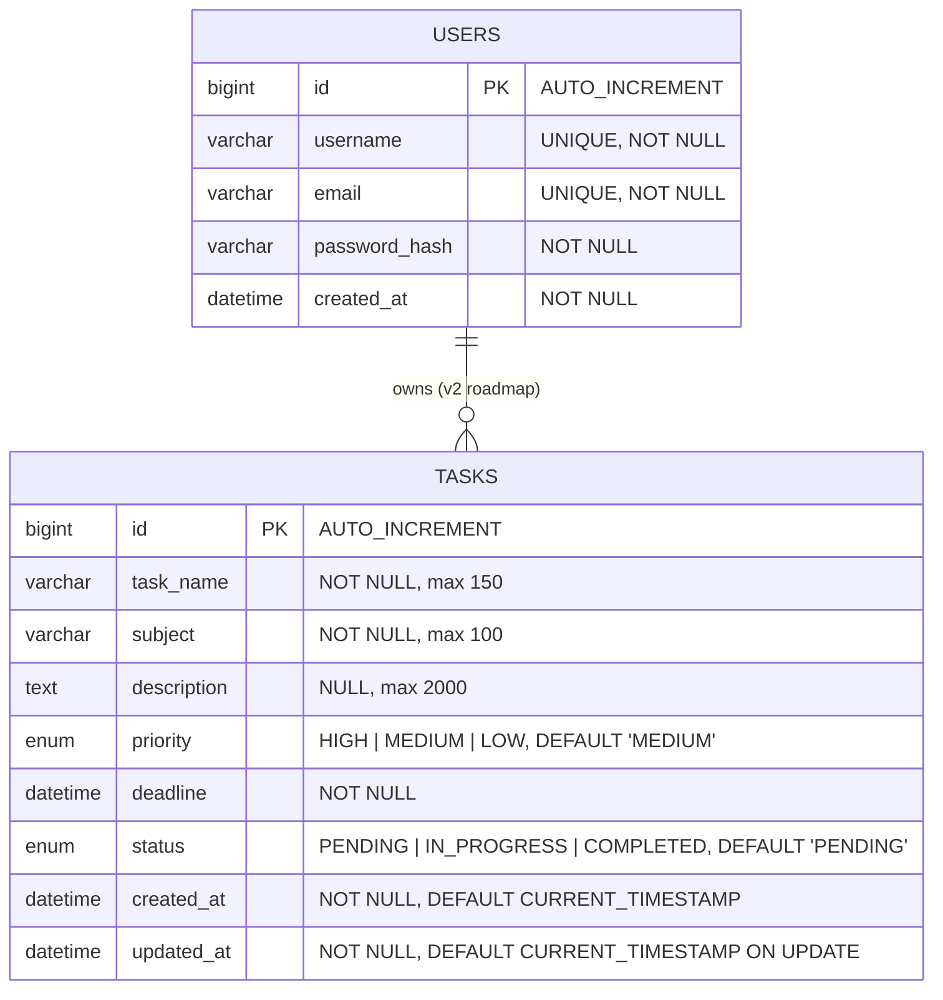

# Entity-Relationship (ER) Diagram & Database Schema

This document details the database design, schema dictionary, indexing strategy, and ER diagrams for the **Smart Study Planner & Task Management System**.

---

## 1. Database Architecture Overview

- **RDBMS**: MySQL 8.x
- **Database Name**: `study_planner_db`
- **Character Set**: `utf8mb4`
- **Collation**: `utf8mb4_unicode_ci`
- **ORM / Persistence**: Spring Data JPA / Hibernate 6.x
- **DDL Migration Source**: [docs/schema.sql](file:///p:/Projects/smart-study-planner/docs/schema.sql)

---

## 2. Mermaid ER Diagram



---

## 3. ASCII ER Diagram

```
┌────────────────────────────────────────────────────────────────────────┐
│                                 TASKS                                  │
├────────────────────────────────────────────────────────────────────────┤
│  PK  id              BIGINT        AUTO_INCREMENT                      │
│      task_name       VARCHAR(150)  NOT NULL                            │
│      subject         VARCHAR(100)  NOT NULL                            │
│      description     TEXT          NULL (up to 2000 chars)             │
│      priority        ENUM          'HIGH', 'MEDIUM', 'LOW'             │
│      deadline        DATETIME      NOT NULL                            │
│      status          ENUM          'PENDING', 'IN_PROGRESS', 'DONE'    │
│      created_at      DATETIME      NOT NULL DEFAULT CURRENT_TIMESTAMP  │
│      updated_at      DATETIME      NOT NULL DEFAULT ON UPDATE NOW()    │
└────────────────────────────────────────────────────────────────────────┘
```

---

## 4. Schema Data Dictionary

### Table: `tasks`

| Column Name | SQL Data Type | Nullable | Default Value | Constraints | Description |
|---|---|---|---|---|---|
| `id` | `BIGINT` | **No** | Auto Increment | `PRIMARY KEY` | Unique surrogate identifier |
| `task_name` | `VARCHAR(150)` | **No** | None | `@NotBlank`, `@Size(max=150)` | Title/Name of the study task |
| `subject` | `VARCHAR(100)` | **No** | None | `@NotBlank`, `@Size(max=100)` | Academic subject / category |
| `description` | `TEXT` | Yes | `NULL` | `@Size(max=2000)` | Optional task details and study notes |
| `priority` | `ENUM('HIGH','MEDIUM','LOW')` | **No** | `'MEDIUM'` | `@NotNull`, `@Enumerated(STRING)` | Task priority level |
| `deadline` | `DATETIME` | **No** | None | `@NotNull`, `@FutureOrPresent` | Due date and time |
| `status` | `ENUM('PENDING','IN_PROGRESS','COMPLETED')` | **No** | `'PENDING'` | `@NotNull`, `@Enumerated(STRING)` | Task execution lifecycle state |
| `created_at` | `DATETIME` | **No** | `CURRENT_TIMESTAMP` | `@CreationTimestamp` / `@PrePersist` | Audit timestamp when record was created |
| `updated_at` | `DATETIME` | **No** | `CURRENT_TIMESTAMP` | `@UpdateTimestamp` / `@PreUpdate` | Audit timestamp when record was last updated |

---

## 5. Indexing & Query Optimization Strategy

To ensure high performance and sub-millisecond query execution, the following indexes are defined on the `tasks` table in [docs/schema.sql](file:///p:/Projects/smart-study-planner/docs/schema.sql):

| Index Name | Indexed Columns | Index Type | Optimization Target / Justification |
|---|---|---|---|
| `PRIMARY` | `id` | Clustered BTREE | Direct point lookups by ID (`GET /api/tasks/{id}`, `PUT /api/tasks/{id}`, `DELETE /api/tasks/{id}`) |
| `idx_tasks_deadline` | `deadline` | Non-clustered BTREE | Sorting tasks by deadline ascending/descending (`sortBy=deadline`) |
| `idx_tasks_status` | `status` | Non-clustered BTREE | Fast filtering by status and counting dashboard aggregates (`countByStatus(PENDING)`) |
| `idx_tasks_priority` | `priority` | Non-clustered BTREE | Fast filtering by priority (`priority=HIGH`) |
| `idx_tasks_subject` | `subject` | Non-clustered BTREE | Keyword searching and filtering by subject |
| `idx_tasks_status_deadline` | `status, deadline` | Composite BTREE | Optimizes the dashboard upcoming deadlines query: `WHERE status IN ('PENDING', 'IN_PROGRESS') AND deadline >= NOW() ORDER BY deadline ASC LIMIT 5` |

---

## 6. Entity Mapping & Lifecycle Callbacks

The JPA Entity `com.studyplanner.taskmanager.entity.Task` mirrors this table structure:

- **String Enumerations**: Enums are persisted via `@Enumerated(EnumType.STRING)` rather than `ORDINAL` to ensure schema safety and prevent data corruption if enum order changes.
- **Audit Lifecycle**:
  - `@PrePersist`: Automatically initializes `createdAt` and `updatedAt` to `LocalDateTime.now()` upon insertion.
  - `@PreUpdate`: Automatically updates `updatedAt` to `LocalDateTime.now()` before database flush.
- **Validation**: Enforced at the boundary through Jakarta Bean Validation on DTOs (`@NotBlank`, `@FutureOrPresent`, `@Size`).

---

## 7. Future Schema Extensions (Roadmap)

1. **User Authentication & Multi-Tenancy (v2)**:
   - Introduce `users` table: `id`, `username`, `email`, `password_hash`, `role`, `created_at`.
   - Add foreign key `tasks.user_id` referencing `users.id` with `INDEX idx_tasks_user_id (user_id)`.
2. **Task Categorization & Tags**:
   - Introduce `tags` table and `task_tags` join table (`task_id`, `tag_id`) for many-to-many topic tagging.
3. **Subtasks / Checklist**:
   - Introduce `subtasks` table: `id`, `task_id` (FK), `title`, `is_completed`, `order_index`.
